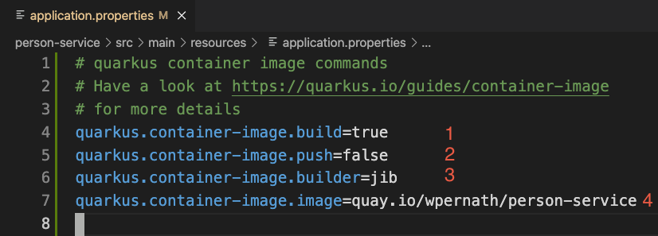
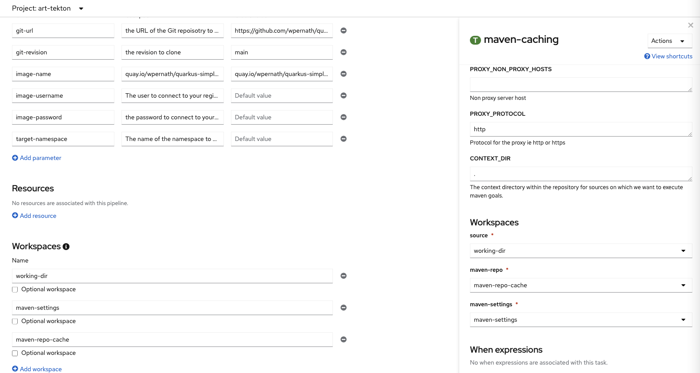

# Chapter Four: CI with Tekton Pipelines
Chapters 2 and 3 of this book discussed the basics of application packaging with Kustomize, Helm Charts, and Operators. They also discussed how to handle images and all the metadata required for working with Kubernetes. 

This chapter discusses how to integrate native pipelines into Kubernetes using [Tekton](https://tekton.dev). 

## Tekton / OpenShift Pipelines
[Tekton](https://tekton.dev "Tekton Homepage") is an open source framework to create pipelines in a Kubernetes and cloud-native way. This means, there is no central tool you need to maintain (like Jenkins, for example) but you only have to install a Kubernetes Operator into your Kubernetes cluster, which provides some custom resource definitions (CRDs). 

Based on those CRDs, you can create Tasks and Pipelines which suite your needs to compile, test, deploy and maintain your application. 

OpenShift Pipelines is based on Tekton and adds a nice GUI to the OpenShift Developer Console. The Pipelines Operator is free to use for every OpenShift user. 

### Tekton Concepts
Tekton has numerous of objects, but the architecture is quite easy to understand:

- **`Step`**. A `Step` is the execution unit of a `Task`. It runs in its own container and can execute whatever the container image provides. A `Step` does not stand for itself but must be embedded within a `Task`.
- **`Task`**. A `Task` contains a set of steps which are running in separate containers (`Pod`s). A `Task` could be for example a compilation process with maven. One step would be to check the maven `settings.xml`. The second step could be to execute the maven goals (compile, package etc.)
- **`Pipeline`**. A pipeline consists of a set of `Task`s which are executed either in parallel or (in a simpler case) one after one. 

To summarize it: A pipeline contains a list of tasks, which each contain a list of steps.  One of the benefits of Tekton is that tasks and also pipelines can be shared with other people, because a Pipeline only contains what to do in a given order. So if you know that most of your projects have a similar pipeline, share and reuse it. 

A pipeline must be invoked with parameters, a so called **PipelineRun**. So in order to start the Pipeline „build-and-deploy“, you need to create a PipelineRun object, which contains technical input (like for example ConfigMaps and PersistentVolumeClaims) and non-technical parameters (like for example the URL for the Git repository to clone, the name of the target image etc.)

Internally, Tekton creates a **TaskRun** object for each Task it finds in a `PipelineRun`. 

### Installing the CLI tool 
Tekton comes with a CLI tool called `tkn`, which you can easily install on macOS by issuing:

```bash
$> brew install tektoncd-cli
```
 
Please have a look at the official homepage of Tekton to see how to install the CLI tool on other OS. 

### Installing OpenShift Pipelines on OpenShift
Red Hat OpenShift comes with an Kubernetes Operator called „OpenShift Pipelines“ which you can easily install as cluster-admin by going to the OperatorHub, searching for „Pipelines“ and clicking on „install“. There is nothing more to do for now, as the Operator maintains everything for us. 


After a while you’ll notice a new GUI entry in both the Administrator and the Developer UI. 


### Our use case: Create a pipeline for quarkus-simple
For our well known [person-service](https://github.com/wpernath/book-example/tree/main/person-service "Quarkus Simple"), we are going to create a Tekton Pipeline, which shouldn’t do much more than compiling the source, creating a Docker image based on [JIB](https://github.com/GoogleContainerTools/jib "Google's JIB"), pushing it to [Quay.io](https://quay.io/repository/wpernath/quarkus-simple-wow "quay.io") and using [kustomize](https://www.opensourcerers.org/2021/04/26/automated-application-packaging-and-distribution-with-openshift-part-12/ "Kustomize explained ") to apply that image to an OpenShift project called book-tekton. 

Sounds easy? 

It is. Well, mostly. 

First of all, why are we going to use JIB for building the container image? - Well, that’s easily explained: Right now, there are three different container image build strategies available with Quarkus. 
- Docker
- S2I
- JIB
The Docker strategy is using the `docker` binary to build the container image. But the `docker` binary is not available inside a Kubernetes cluster (as mentioned in the last chapter, Docker is too heavy weighted and requires root privileges to run the daemon). 

S2I requires creating OpenShift specific `BuildConfig`s, `DeploymentConfig`s and `ImageStream`s, which are not available in vanilla Kubernetes clusters. 

In order to stay vendor independent, we have to use JIB for this use case. 

Of course, you could also use other tools to create your container image inside Kubernetes. But in order to keep this Tekton example clean and simple, we are reusing what Quarkus provides to us. So we are able to simply set a few Quarkus properties in `application.properties` to define how Quarkus should package the application. Now we are able to use exactly ONE Tekton task to compile, package and push the application to an external registry.

Make sure, your Quarkus application is using the required Quarkus extension called `container-image-jib`. If your `pom.xml` does not include the dependency `quarkus-container-image-jib`, add it by executing

```bash
$> mvn quarkus:add-extension -Dextensions="container-image-jib"
[INFO] Scanning for projects...
[INFO]
[INFO] -------------------< org.wanja.book:person-service >--------------------
[INFO] Building person-service 1.0.0
[INFO] --------------------------------[ jar ]---------------------------------
[INFO]
[INFO] --- quarkus-maven-plugin:2.4.2.Final:add-extension (default-cli) @ person-service ---
[INFO] Looking for the newly published extensions in registry.quarkus.io
[INFO] [SUCCESS] ✅  Extension io.quarkus:quarkus-container-image-jib has been installed
[INFO] ------------------------------------------------------------------------
[INFO] BUILD SUCCESS
[INFO] ------------------------------------------------------------------------
[INFO] Total time:  5.817 s
[INFO] Finished at: 2021-11-22T09:34:05+01:00
[INFO] ------------------------------------------------------------------------
```

Then have a look at Figure 3 to see what properties need to be set to let Quarkus build, package and push the image.

Basically, there are 3 necessary properties to be set in `application.properties`:


1. **`quarkus.container-image.build`**: Makes sure that a `mvn package` would build the container image at all
2. **`quarkus.container-image.push`**: This is optional and only required if you want to push the image directly to the registry
3. **`quarkus.container-image.builder`**: Selects the method of building the container image. We want to use [JIB](https://github.com/GoogleContainerTools/jib "Google's JIB").
4. **`quarkus.container-image.image`**: The complete name of the image to be build. 

Now checkout the [source code](https://github.com/wpernath/book-example), have a look at `person-service/src/main/resources/application.properties`, change the image property to your needs and call

```bash
$> mvn clean package -DskipTests
```

to compile the sources and build the container image. If you want to push the resulting image to your registry, simply call

```bash
$> mvn package -DskipTests -Dquarkus.container-image.push=true
```

After a while, Quarkus has generated and pushed your image to your registry. In my case, it’s `quay.io/wpernath/person-service?`.

### Inventory check: What do we need?
In order to create our use case, we need to have the following tasks available:

- **git:** We want to fetch the source from GitHub.com
- **maven:** We want to reuse most of that what Quarkus provides to us
- **kustomize:** We want to use kustomize to change our Deployment to point to the new Image
- **OpenShift client:** We need to apply the changes we’ve made in the steps before

Let’s log into our OpenShift cluster, create a new project and list all the available ClusterTasks:

```bash
$> oc login ..... 
$> oc new-project book-tekton
$> tkn ct list
```


Figure 4 shows all the available ClusterTasks after you’ve installed the OpenShift Pipelines Operator. It seems, we have everything, we need
- git-clone
- maven
- openshift-client

We are just missing the `Kustomize` task. But let’s create one later. We first want to take care of the rest.

Wait. What is the difference between a Task and a ClusterTask? - This is easy. A ClusterTask is available globally in all projects. A Task is only available locally per project and must be installed into each project, where you want to use it.

### Analyzing the necessary tasks
If you want to have a look at the structure of a Task, you can easily execute the following:

```bash
$> tkn ct describe <task-name>
```

This explains all the parameters of the task together with other necessary things, like inputs and outputs.

By specifying the parameter `-o yaml`, we are able to get the YAML source definition of the task. 

The git-clone task requires quite some parameters, but most of them are optional. We just have to specify `git-url` and `git-revision`. 

And we have to specify a workspace for the task. 


### What are workspaces?
Remember that Tekton is running each and every Task (and all Steps inside a Task) as a separate Pod? If the app running on the Pod writes to some random folder, nothing gets really stored. So if we want (and yes, we want) to have the complete pipeline being able to read and write data on each step, we have to find a way to do that. 

This is what workspaces are for. They could be a persistent volume claim, a config map etc. A task which requires either something to store data to (like git-clone) or needs to have access to data coming from a previous step (like maven), defines a workspace. If the task is embedded into a Pipeline, it will also be defined there. The PipelineRun (or in case of a single running task, the TaskRun) finally creates the mapping between the defined workspace and a corresponding storage. 

In our example we need two workspaces:
- A PVC where the git-clone task is cloning the source code to and from where the maven task is compiling the source
- A ConfigMap with the maven-settings file you need in your environment 

### Ways of building the Pipeline
Once you know what tasks you need in order to build your pipeline, you can start creating it. 

There are two ways of doing it:
- Build your Pipeline via a code editor as a YAML file
- Build it with OpenShift Developer Console

As a first approach, I’d recommend that you’re building the pipeline via the graphical Developer Console of OpenShift, then export and analyze it how it looks like.

### Building the Pipeline via OpenShift Developer Console
Note, you should have at least version 1.4.1 of the OpenShift Pipelines Operator installed (for this you need a recent 4.7 OpenShift cluster, which you could install for example via [CodeReady Containers](https://github.com/code-ready/crc)). Otherwise, you don’t have access to workspaces (which you need to define). 


As you can see, you have to provide parameters to each and every task. And you need to link the required workspaces to the tasks. You can easily do that by using the GUI. 



We want to use the task `maven` twice:
- For simple compilation of the source code by executing goal `package`
- For image generation and pushing by executing `package` and providing the following parameters to [instruct quarkus to build and push the image](https://quarkus.io/guides/container-image#quarkus-container-image-jib_quarkus.jib.base-jvm-image)
	- `-Dquarkus.container-image.push=true`
	- `-Dquarkus.container-image.builder=jib`
	- `-Dquarkus.container-image.image=$(params.image-name)`
	- `-Dquarkus.container-image.username=$(params.image-username)`
	- `-Dquarkus.container-image.password=$(params.image-password)`

Once you’ve done all that and have clicked on „Save“, you’re able to export the yaml file by executing

```bash
$> oc get pipeline/build-and-push-image -o yaml > tekton/pipelines/build-and-push-image.yaml
apiVersion: tekton.dev/v1beta1
kind: Pipeline
metadata:
  name: build-and-push-image
spec:
  params:
  - default: https://github.com/wpernath/book-example.git
    description: the URL of the Git repoisotry to build
    name: git-url
    type: string
....
```

You can easily re-import the pipeline file by executing

```bash
$> oc apply -f tekton/pipelines/build-and-push-image.yaml
```


### Notes on Task parameter placement
One of the goals of Tekton has always been to be as reusable as possible. Which means, you’re most likely using general-purpose tasks, which try to be as generic as possible. 

If you’re providing the necessary parameters directly to each Task, you might repeat the settings over and over again (for example in our case, we are using the maven task for compiling, packaging, image generation and pushing). In this case it makes sense to draw the parameters out of the specification of each task. Put them on pipeline level and reference them inside the corresponding task by specifying them with `$(params.parameter-name)`


### Creating a new Task: kustomize
As we want to use Kustomize to apply the new image to our Deployment, we have to look for a proper task in the [Tekton Hub](https://hub.tekton.dev). Unfortunately, there doesn’t seem to be one available, so we have to create our own one.

For this, we first need to have a proper image which contains the kustomize executable. The Dockerfile for this is available [here](https://github.com/wpernath/kustomize-ubi) and the image is available [here](https://quay.io/repository/wpernath/kustomize-ubi).

Now let’s create a new Tekton Task. 

```yaml
apiVersion: tekton.dev/v1beta1
kind: Task
metadata:
  name: kustomize
  labels:
    app.kubernetes.io/version: "0.4"
  annotations:
    tekton.dev/pipelines.minVersion: "0.12.1"
    tekton.dev/tags: build-tool
spec:
  description: >-
    This task can be used to execute kustomze build scripts and to apply the changes via oc apply -f
  workspaces:
    - name: source
      description: The workspace holding the cloned and compiled quarkus source.
  params:
    - name: kustomize-dir
      description: Where should kustomize look for kustomization in source?
    - name: target-namespace
      description: Where to apply the kustomization to
    - name: image-name
      description: Which image to use. Kustomize is taking care of it
  steps:
    - name: build
      image: quay.io/wpernath/kustomize-ubi:latest
      workingDir: $(workspaces.source.path)
      script: |
        
        cd $(workspaces.source.path)/$(params.kustomize-dir)

        DIGEST=$(cat $(workspaces.source.path)/target/jib-image.digest)

        kustomize edit set image quay.io/wpernath/simple-quarkus:latest=$(params.image-name)@$DIGEST
        
        kustomize build $(workspaces.source.path)/$(params.kustomize-dir) > $(workspaces.source.path)/target/kustomized.yaml
        
    - name: apply
      image: 'image-registry.openshift-image-registry.svc:5000/openshift/cli:latest'
      workingDir: $(workspaces.source.path)
      script: |
        oc apply -f $(workspaces.source.path)/target/kustomized.yaml -n $(params.target-namespace)
```

Paste this text into a new file called `kustomize-task.yaml`. As you can see, this task requires a workspace called `source` and three parameters (`kustomize-dir`, `target-namespace` and `image-name`). And it has two  steps (`build` and `apply`). 

The build-step uses the Kustomize image to set the new image and digest. The apply-step finally uses the OpenShift internal CLI image to apply the kustomized files in the `target-namespace`. 

To load the kustomize-task.yaml into your current OpenShift project, simply execute

```bash
$> oc apply -f kustomize-task.yaml
task.tekton.dev/kustomize configured
```

### Putting it all together
We now have created a Pipeline which contains four tasks (git-clone, package, build-and-push-image and apply-kustomize). We have provided the necessary parameters to each task and to the pipeline and we have connected workspaces to it. 

Now we have to create the PersistentVolumeClaim and a maven-settings ConfigMap, which will then be used by the corresponding PipelineRun. 

#### Creating a maven-settings ConfigMap
If you have a working maven settings file, you can easily reuse it with the maven task. Simply create it via 

```bash
$> oc create cm maven-settings --from-file=/your-maven-settings --dry-run=client -o yaml > maven-settings-cm.yaml
```

If you need to edit the ConfigMap, feel free to do this right now and then execute 

```bash
$> oc apply -f maven-settings-cm.yaml
```

To import the ConfigMap into your current project.

#### Creating a PersistentVolumeClaim 
Create a new file with the following content and execute `oc apply -f` to import it into your project
 
```yaml
apiVersion: v1
kind: PersistentVolumeClaim
metadata:
  name: builder-pvc
spec:
  resources:
    requests:
      storage: 10Gi
  volumeMode: Filesystem
  accessModes:
    - ReadWriteOnce
  persistentVolumeReclaimPolicy: Retain

```

This file reserves a PVC with name `builder-pvc` and a requested storage of 10GB. It’s important to use `persistentVolumeReclaimPolicy: Retain` here, as we want to reuse build artifacts from last builds. More on this part later in this chapter. 

### Running the pipeline
Once you have imported all your artifacts into your current project, you are able to run the Pipeline. For this, click on the „Pipelines“ entry on the left side of the Developer Perspective of OpenShift, choose your created Pipeline and select „Start“ from the „Actions“ menu on the right side. After you’ve filled in all necessary parameters, you’re able to start the PipelineRun.


On „Logs“ and „Events“ cards of the OpenShift Pipeline Editor you’re able to see all logs and - well - events. I prefer the command line, so I am using `tkn` to follow the logs of my pipeline run. 

```bash
$> tkn pr
```

Shows you the available actions for pipeline runs. As you can see, you’re able to log, list, cancel and delete pipeline runs. 

```bash
$> tkn pr list
NAME                                       STARTED        DURATION     STATUS
build-and-push-image-run-20211123-091039   1 minute ago   54 seconds   Succeeded
build-and-push-image-run-20211122-200911   13 hours ago   2 minutes   Succeeded
build-and-push-image-ru0vni                13 hours ago   8 minutes    Failed 
```

To follow the logs of the last run, simply execute 
```bash
$> tkn pr logs -f -L
```

If you ignore `-L`, `tkn` lets you choose from the list of PipelineRuns. 

Note, there is also a Tekton Pipeline Extension available for Visual Code, which you can also use to edit, build and execute Pipelines. 

### Creating a PipelineRun object
In order to start the Pipeline via a shell (or from any other application you’re using for CI/CD), you need to create a PipelineRun object, which looks like the following:

```yaml
apiVersion: tekton.dev/v1beta1
kind: PipelineRun
metadata:
  name: $PIPELINE-run-$(date "+%Y%m%d-%H%M%S")
spec:
  params:
    - name: git-url
      value: https://github.com/wpernath/book-example.git
    - name: git-revision
      value: main
    - name: context-dir
      value: the-source
    - name: image-name
      value: quay.io/wpernath/person-service
    - name: image-username
      value: wpernath
    - name: image-password
      value: *****
    - name: target-namespace
      value: book-tekton
  workspaces:
    - name: shared-workspace
      persistentVolumeClaim:
        claimName: builder-pvc
    - configMap:
        name: maven-settings
      name: maven-settings
  pipelineRef:
    name: build-and-push-image
  serviceAccountName: pipeline
```

Most of the attributes of this object are self explaining. Just one word on the attribute `serviceAccountName`: Each PipelineRun runs under a given service account, which means, all Pods which are being started along the Pipeline are running inside this security context. 

OpenShift Pipelines creates a default service account for you, called `pipeline`. If you have Secrets which you want to make available to your PipelineRun, you have to connect those with the service account name. But this is out of topic for this chapter of the book. 

You can find a shell script in the folder `tekton/pipeline.sh` which creates a full version of this PipelineRun based on input parameters. 

### Optimizing the pipeline
As you can see, the first pipeline run takes quite a long time to finish. In my case approximately 8 minutes. The second still took 2 minutes. Of course, later, when you’re using Tekton on your build farms, this should automatically be minimized as you’re running on dedicated server hardware (and not on a home server, like I do). 

But still, this takes way too long. 

If you’re looking at the logs, you can see that the maven task is taking a long time to finish. This is because maven is downloading the necessary artifacts on every run again and again. Depending on your internet connection, this takes some time, even if you’re using a local maven mirror. 

On your developer machine, maven uses the $HOME/.m2 folder as a cache for the artifacts. The same will be done when you’re running maven from a Task. 

However, as each PipelineRun runs on separate Pods, $HOME/.m2 is not properly defined, which means the whole cache gets invalidated once the PipelineRun is finished. 

Maven allows us to specify `-Dmaven.repo.local` to provide a different path to a local cache. This is what we can use in our case. 

I have created a new maven Task (`maven-caching`), which you can find [here](https://raw.githubusercontent.com/wpernath/book-example/main/tekton/tasks/maven-task.yaml). It was originally just a copy of the one coming from Tekton Hub. But then I decided to remove the init step, which was building a maven settings.xml file based on some input parameters. Instead, I removed most of the parameters and added a MUST-HAVE maven settings ConfigMap. As this makes everything much easier, IMHO.


As you can see in Image 9, we only have two parameters now (`GOALS` and `CONTEXT_DIR`). 

The important part for the maven call is shown in the second red box of Figure 9. It simply calls maven with the maven settings and with the parameter where to store the downloaded artifacts to. 

One note on artifact storage: During my tests of this article, I realized that if the git-clone task clones the source to the root directory of the PVC (no `subdirectory` parameter given on task execution), the next start of the pipeline will delete everything from the PVC again (which means, we again have no artifact cache). 

This means, we have to provide a `subdirectory` parameter (in my case, I used a global `the-source`) and we have to provide exactly the same value to  the `CONTEXT_DIR` parameter to the maven calls.

With this in mind, we can reduce our maven calls dramatically from in my case 8 minutes to 54 seconds.  

```bash
$> tkn pr list
NAME					   STARTED        DURATION     STATUS
build-and-push-image-123   1 minute ago   54 seconds   Succeeded
build-and-push-image-ru0   13 hours ago   8 minutes    Succeeded
```


## Summary of using Tekton Pipelines
Tekton is a powerful tool to create CI/CD pipelines. As it is based on Kubernetes, it uses all the concepts of it and reduces the maintenance of the tool itself. If you want to quickly start your first pipeline, try to use the OpenShift Developer UI which you get for free, if you’re installing the Operator. This gives you a nice base to start your tests. However, at some point - especially when it comes to optimizations - you need a proper editor to code your pipelines. 

One of the biggest advantages over tools like for example Jenkins is that you can reuse everything of your work for other projects / applications. If you want to standardize the way how your pipelines work, build one pipeline and simply specify different sets of parameters. PipelineRun objects make this possible. The Pipeline we have just created can easily be reused for all Quarkus generated applications. Just change the git-url parameter and the image-name. That‘s all. Isn‘t this great?

And even if you’re not satisfied with all the Tasks you get from Tekton Hub, use them as base and build your own iterations out of it, like we did with the optimized maven task above or with the kustomize task. 

I would not say, that Tekton is the easiest technology available to do CI/CD pipelines, but it is definitely one of the most flexible ones. 

However, we have not even talked about [Tekton security](https://tekton.dev/docs/pipelines/auth/) and how we are able to provide for example secrets to access your Git repository or the image repository. And we have cheated a little bit about image generation as we were using the mechanism Quarkus provides. There are other ways of creating images with a dedicated `buildah` Task. 

The next chapter of this book will discuss GitOps and ArgoCD and is also explaining Tekton security.
