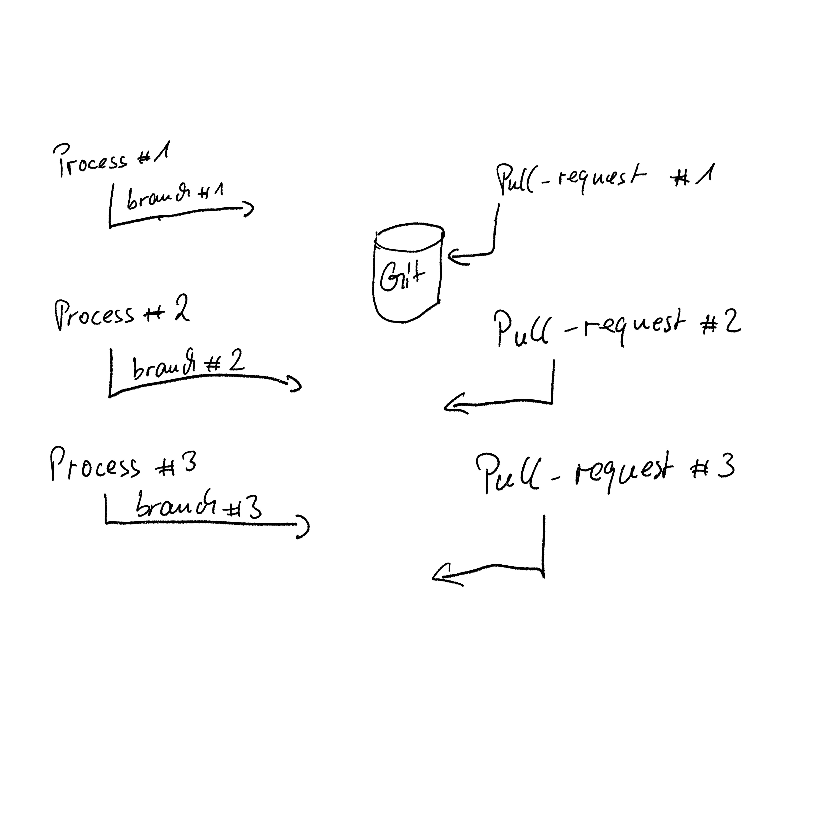

# Chapter Five: GitOps And ArgoCD
The first parts of this article series were discussing the basics of modern application development with Kubernetes. The last part has shown you how to integrate into Kubernetes native pipelines to do your CI/CD and to automatically deploy your application out of a pipeline run. 

This part of the series discusses the risks and benefits of using GitOps and ArgoCD in your project and gives you some hints on how to use it with OpenShift.

## Introduction to GitOps
„We are still struggling to implement DevOps and now you’re coming with yet another new fancy acronym, which should help us solving all our issues, we still have?“ This is something I have heard when I first talked about GitOps during a customer engagement. 

The short answer is: DevOps is a cultural change in your enterprise, meaning that Developers and Operations people should talk to each other instead of doing their work secretly behind big walls. 

GitOps is an evolutionary way of implementing continuous deployments for cloud- and Kubernetes-native applications. The idea behind it is „[having a Git repository that always contains descriptions of the infrastructure currently desired in production environment and an automated process to make the production environment match the desired state. If you want to make a new deployment, simply update the files in the Git repository.“](https://www.gitops.tech "GitOps description")

But why Git? And why now? And what does Kubernetes has to do with all that? 

As you’ve seen in [chapter one](https://www.opensourcerers.org/2021/04/26/automated-application-packaging-and-distribution-with-openshift-part-12/) of this article series, you have to maintain the description of your infrastructure anyway. Each application you’re deploying on Kubernetes, has a bunch of YAML-files which are required to run your application. Adding those files to your project in a Git repository is just a natural step forward. And if we’d now have a tool which could read those files from the repository and apply them to a specified Kubernetes namespace… wouldn’t that be great?

Well, this is GitOps. And [ArgoCD](https://argoproj.github.io/argo-cd/) is one of the available tools to help you doing GitOps. 

## How does a typical GitOps process look like?
One of the most often asked question is: Is GitOps just another way of doing CI/CD? The answer to this question is simply NO. GitOps only takes care of the CD part, the delivery part. 

Without GitOps, the developer workflow looks like this:
- A developer is implementing a change request
- Once the developer commits the changes to Git, an integration pipeline is being started
- This pipeline compiles the code, runs all automated tests, creates and pushes the image and once it’s done, the pipeline automatically installs the application on the TEST stage. 

With GitOps, the developer workflow looks like this (see Image 1):
- A developer is implementing a change request
- Once the developer commits the changes to Git, an integration pipeline is being started
- This pipeline compiles the code, runs all automated tests, creates and pushes the image and once it’s done, the pipeline automatically updates the config Git repository to reflect the changes 
- The CD tool will then see a new desired state in Git which will then be synchronized to the Kubernetes environment


So, you’re still using your Tekton or Jenkins (or whatever tooling you use) based Pipeline to do continuous integration. GitOps then takes care of the CD part. 

## ArgoCD Concepts
Right now (as of version 2.0), the concept of ArgoCD is quite easy. You’re registering an Argo Application which contains pointers to the necessary Git repository with all the application specific descriptors like Deployment, Service etc. and the Kubernetes cluster. 

You might also define an Argo Project, which defines various defaults like
- Which source repos are allowed 
- Which destination servers and namespaces are allowed to deploy to
- A whitelist of cluster resources to deploy, like Deployments, Services etc. 

Once the Application is registered, ArgoCD starts „healing“ the application, if the sync policy is set accordingly. Otherwise, you need to manually start the synchronization.

## The Use Case: Implementing GitOps for our Quarkus-Simple App
We’ve been using the [quarkus-simple application](https://github.com/wpernath/quarkus-simple "Quarkus Simple") over the last three blog posts. Let’s continue to use this and create a GitOps workflow for it. You can find all resources we are discussing here in the `gitops` folder within the `quarkus-simple` application on GitHub.

We are going to setup ArgoCD (via [OpenShift GitOps Operator](https://docs.openshift.com/container-platform/4.8/cicd/gitops/gitops-release-notes.html)) on OpenShift 4.8 (via [CodeReady Containers](https://github.com/code-ready/crc)). We are going to use [Tekton to build a pipeline](https://www.opensourcerers.org/2021/07/26/automated-application-packaging-and-distribution-with-openshift-tekton-pipelines-part-34-2/) which updates our [quarkus-simple-config](https://github.com/wpernath/quarkus-simple-config) Git repository with the latest image digest of the build. ArgoCD should then detect the changes and should start a synchronization of our application.

**NOTE:  Typically, a GitOps pipeline is not directly pushing changes into the main branch of a configuration repository. Instead, the pipeline should commit into a feature- or release branch and should create a pull request, so that changes can be reviewed before they are merged to the main branch. **

But first of all, let’s create a new repository for our application configuration (`quarkus-simple-config`).

## The Application Configuration Repository
One of the main concepts of GitOps is that you’re going to have a Git repository of your application. This could either be part of the source code repository or separated from it. As I am a big fan of [„separation of concerns“](https://deviq.com/principles/separation-of-concerns), I am going to create a new repository with just the [kustomize](https://www.opensourcerers.org/2021/04/26/automated-application-packaging-and-distribution-with-openshift-part-12/) based configuration of my application.

```bash
$> tree 
└── config
    ├── base
    │   ├── config-map.yaml
    │   ├── deployment.yaml
    │   ├── kustomization.yaml
    │   ├── route.yaml
    │   └── service.yaml
    └── overlays
        ├── dev
        │   └── kustomization.yaml
        ├── prod
        │   └── kustomization.yaml
        └── stage
            ├── apply-health-checks.yaml
            ├── change-env-value.yaml
            └── kustomization.yaml

6 directories, 10 files
```

Of course, there are several ways of structuring your config repositories. 
- Having just one config repository with all files of all services and all stages
- Having ONE config repository per service / application with all files for all stages
- Having separated config repositories per service and stage

This is completely up to you. In terms of readability and „separation of concerns“, I would not encourage you to go with the first option. And if you know that you’re going to maintain hundredths of apps / services, I would also not encourage you to use the third option, as you’d end up with hundredths of Git repositories times number of stages you have to go with. 

I guess, the best option is option number two: One repository per service with all files of all stages. 

For now we’re going to create this config repository by copying those files from  `quarkus-simple/kustomize_ext` folder into the newly created Git repository.

**NOTE: The original kustomization.yaml file already contains an image section. This should be removed first.**

## Installing the OpenShift GitOps Operator
As the OpenShift GitOps Operator is free of charge for any OpenShift user, I am just focusing on this as it comes quite well preconfigured. If you want to dig into ArgoCD installation, please feel free to have a look at the official [guides](https://argo-cd.readthedocs.io/en/latest/getting_started/). 


The [OpenShift GitOps Operator can easily be installed in OpenShift](https://docs.openshift.com/container-platform/4.8/cicd/gitops/installing-openshift-gitops.html). Just use a user with cluster-admin rights and switch to the Administrator perspective of the OpenShift Console. Then go to the Operators menu entry and select OperatorHub. In the search field type something like GitOps and select the GitOps Operator.

Once it is installed, you are going to have a new newspace called `openshift-gitops`, where an instance of ArgoCD is installed and ready to be used. 

As of time of this writing, ArgoCD is not yet configured to use OpenShift authentication, so you have to get the password of the admin user by getting the value of the secret `openshift-gitops-cluster` in namespace `openshift-gitops`:

```bash
$> oc get secret openshift-gitops-cluster -n openshift-gitops -ojsonpath='{.data.admin\.password}' | base64 -d
```

And this is how to get the URL of ArgoCD:

```bash
$> oc get route openshift-gitops-server -ojsonpath='{.spec.host}' -n openshift-gitops
```


## Creating a new Argo Application
The easiest way of creating a new Argo Application is by using ArgoCD GUI. After you’ve been logged in, you can simply click on `New App`, fill in the required fields and click on `Create`. All ArgoCD objects of the default ArgoCD instance will be stored in the namespace `openshift-gitops` from where you are easily able to export them via

```bash
$> oc get Application/quarkus-simple -o yaml -n openshift-gitops
```


- (1): The Application Name
- (2): The ArgoCD Project. In our case it’s default, which was created by - well - default on installation.
- (3): Sync-Policies. Just choose wether you want to have automatic synchronization or not.
- (4): The Git repository with the application metadata (Kubernetes resources)
- (5): The path within the repository which points to the actual files
- (7): The namespace to deploy to

If you want to automatically create the application object in a new Kubernetes instance, export it with the command above and open it with your preferred editor. 
 

After you’ve removed the metadata from the object file, you’re able to use

```bash
$> oc apply -f quarkus-simple-app.yaml -n openshift-gitops
```

To import the application into the predefined ArgoCD instance. Please note, that you have to import the application into the `openshift-gitops` namespace. Otherwise it won’t be recognized by ArgoCD. 

## First synchronization
You will notice that the first synchronization takes quite a while and breaks without doing anything but with an error message. 


This is because the service account of ArgoCD does not have the necessary authority to create typical resources in a new namespace. We have to do the following for each namespace, ArgoCD should take care of:

```bash
$> oc policy add-role-to-user admin system:serviceaccount:openshift-gitops:openshift-gitops-argocd-application-controller -n <target namespace>
```

Or if you prefer to use a YAML description file for this:

```yaml
apiVersion: rbac.authorization.k8s.io/v1
kind: RoleBinding
metadata:
  name: quarkus-simple-role-binding
  namespace: quarkus-simple
roleRef:
  apiGroup: rbac.authorization.k8s.io
  kind: ClusterRole
  name: admin
subjects:
- kind: ServiceAccount
  name: openshift-gitops-argocd-application-controller
  namespace: openshift-gitops
```

**NOTE: You could also provide cluster-admin rights to the ArgoCD service account. This would have the benefit that Argo is able to create everything on its own. The drawback is that Argo is then super user of your Kubernetes cluster.  This might not be very secure. **

After you’ve given the service account the necessary role, you can safely click on `Sync` again and ArgoCD will do the synchronization. 

Whenever you’re changing a file in the corresponding Git repository, ArgoCD will check and see what has changed and will then start the necessary actions to keep both in sync. 


## Creating a Tekton Pipeline to update quarkus-simple-config
We now want to change our pipeline from [part 3 of this article series](https://www.opensourcerers.org/2021/07/26/automated-application-packaging-and-distribution-with-openshift-tekton-pipelines-part-34-2/) to be more GitOps’y. But what exactly needs to be done?


The current pipeline is a development pipeline, which will be used to
- compile and test the code
- create a new image
- push that image to an external registry (in our case [quay.io](https://quay.io))
- use Kustomize to change the image target
- apply the changes via OpenShift CLI to a given namespace

In GitOps, we don’t do pipeline centric deployments anymore. In fact, the final step of our pipeline will be to update our `quarkus-simple-config` Git repository with the new version of the image. 

Instead of the `apply-kustomize` task, we are creating and using `git-update-deployment` task as final step. This task should clone the config repository, use Kustomize to apply the image changes and should finally push the changes back to GitHub.com. 


### A Word On Tekton Security
As we want to update a private repository, we first need to have a look at [Tekton Security](https://tekton.dev/docs/pipelines/auth/). 

Tekton uses specially annotated Secrets with either a `username/password` combination or with a SSH key. It will then produce a `~/.gitconfig` (or in case of an image repository, it creates a `~/.docker/config.json`) and maps it into the Step’s Pod via the Run’s associated ServiceAccount. That’s easy, isn’t it. 

```yaml
apiVersion: v1
kind: Secret
metadata:
  name: git-user-pass
  annotations:
    tekton.dev/git-0: https://github.com
type: kubernetes.io/basic-auth
stringData:
  username: <cleartext username>
  password: <cleartext password>
```

Once we’ve filled in `username` and `password` we could apply the Secret into the namespace where we want to run our newly created Pipeline.

```bash
$> oc new-project art-gitops
$> oc apply -f secret.yaml
```

Now we need to either create a new ServiceAccount for our Pipeline or we need to update the existing one, which was generated by the OpenShift Pipeline Operator: `pipeline`

Let’s decide for a new ServiceAccount: Simply execute `oc get sa/pipeline -o yaml` to see which other secrets this ServiceAccount requires and copy them over to your own ServiceAccount:

```yaml
apiVersion: v1
kind: ServiceAccount
	metadata:
  		name: pipeline-bot
secrets:
- name: git-user-pass
```

Please note, you don’t need to copy those generated Secrets over to your ServiceAccount (`pipeline-dockercfg-`, etc.) as those will automatically be linked with the new ServiceAccount by the Operator. 

- `pipeline-dockercfg-` is the default secret to read/write images from/to the internal registry of OpenShift. 
- `pipeline-token-` is the default secret for the `pipeline` ServiceAccount. This is being used internally.

But we have to create two RoleBindings for the ServiceAccount. Otherwise we can’t reuse the PersistenceVolumes we’ve been using so far (remember, the complete Pipeline runs within the security context of the provided ServiceAccount). 

```yaml
apiVersion: rbac.authorization.k8s.io/v1
kind: RoleBinding
metadata:
  name: piplinebot-rolebinding1
roleRef:
  apiGroup: rbac.authorization.k8s.io
  kind: ClusterRole
  name: pipelines-scc-clusterrole
subjects:
  - kind: ServiceAccount
    name: pipeline-bot
---
apiVersion: rbac.authorization.k8s.io/v1
kind: RoleBinding
metadata:
  name: piplinebot-rolebinding2
roleRef:
  apiGroup: rbac.authorization.k8s.io
  kind: ClusterRole
  name: edit
subjects:
  - kind: ServiceAccount
    name: pipeline-bot
```

The `edit` Role is mainly used if your pipeline needs to change any Kubernetes metadata in the given namespace. If your pipeline doesn’t do things like this, you can safely ignore the Role. In our case, we don’t necessary need the edit Role. 

### The git-update-deployment Tekton Task
Now that we understand Tekton Security and we’ve created all necessary manifests, we are able to focus on the `git-update-deployment` Task.

Remember, we want to have a Task that does the following:
- Cloning the config Git repository
- Updating the image digest via Kustomize
- Committing and pushing the changes back to the repository

This means, we need to create a Task with at least the following parameters:
- **`GIT_REPOSITORY`**. The config repository to clone
- **`CURRENT_IMAGE`**. The name of the image in the deployment.yaml file
- **`NEW_IMAGE`**. The new name of the image to deploy
- **`NEW_DIGEST`**. The digest of the new image to deploy. This was generated in the `build_and_push_image`-Step before.
- **`KUSTOMIZE_PATH`**. The path within the `GIT_REPOSITORY` with the `kustomization.yaml` file

And of course, we need to have a workspace with the project files.

Let’s have a look at the Steps within the Task:
```yaml
  steps:
    - name: git-clone
      image: docker.io/alpine/git:v2.26.2
      workingDir: $(workspaces.workspace.path)
      script: |
        rm -rf git-update-digest-workdir
        git clone $(params.GIT_REPOSITORY) git-update-digest-workdir

    - name: update-digest
      image: quay.io/wpernath/kustomize-ubi:latest
      workingDir: $(workspaces.workspace.path)
      script: |
        cd git-update-digest-workdir/$(params.KUSTOMIZATION_PATH)
        kustomize edit set image $(params.CURRENT_IMAGE)=$(params.NEW_IMAGE)@$(params.NEW_DIGEST)

    - name: git-commit
      image: docker.io/alpine/git:v2.26.2
      workingDir: $(workspaces.workspace.path)
      script: |
        cd git-update-digest-workdir

        git config user.email "tekton-bot@my-domain.com"
        git config user.name "My Tekton Bot"

        git add $(params.KUSTOMIZATION_PATH)/kustomization.yaml
        git commit -m "[ci] Image digest updated"
        
        git push
```

Nothing special here. It’s the same we’d do via CLI. The full task and everything else can be found in the `gitops/tekton` folder of the [quarkus-simple repository](https://github.com/wpernath/quarkus-simple) on GitHub (as always). 

The next question would be, how to get the image digest?

### Creating an extract-digest Tekton Task
As we are using [Quarkus image builder (which in fact is using JIB)](https://www.opensourcerers.org/2021/07/26/automated-application-packaging-and-distribution-with-openshift-tekton-pipelines-part-34-2/), we need to create either a Step or a separate Task which is providing the content of the file `target/jib-image.digest`. As I want to have the `git-update-deployment` Task as generally usable as possible, I am creating a separate Task with exactly one step. — I also want to briefly discuss [Tekton’s feature of a Task emitting results](https://tekton.dev/docs/pipelines/tasks/#emitting-results). 

Within the `spec:` section of a Task, you’re able to define `results`. All results are being stored in `$(results.<result-name>.path)`. Results are available in all Tasks and also on Pipeline level via

```bash
$(tasks.<task-name>.results.<result-name>)
```

This is the Step which is extracting the DIGEST and stores it into a result:

```yaml
spec:
  params:
    - name: image-digest-path
      default: target

  results:
    - name: DIGEST
      description: The image digest of the last quarkus maven build with JIB image creation

  steps:
    - name: extract-digest
      image: quay.io/wpernath/kustomize-ubi:latest
      script: |
		# extract DIGEST
        DIGEST=$(cat $(workspaces.source.path)/$(params.image-digest-path)/jib-image.digest)

		# Store DIGEST into result
        echo -n $DIGEST > $(results.DIGEST.path)
```

### Creating the Pipeline
Now it’s time to summarize everything into a new pipeline. 


Start by using the [previous non-gitops pipeline](https://raw.githubusercontent.com/wpernath/quarkus-simple/main/tektondev/pipelines/tekton-pipeline.yaml), which we’ve created in [chapter 3 of this article series](https://www.opensourcerers.org/2021/07/26/automated-application-packaging-and-distribution-with-openshift-tekton-pipelines-part-34-2/), remove the last task and add `extract-digest` and `git-update-deployment` as new tasks. 

We also need two more parameters on pipeline level 
- config-git-url
- config-dir

Which we are going to map over to the `git-update-deployment` task, as Image 10 shows. 


### Testing the Pipeline
To start the pipeline, simply navigate within the Developer perspective to the Pipelines section of the menu in your `art-gitops` project of the OpenShift UI, select the pipeline and click „Start“ in the „Actions“ menu. Then fill in all the necessary parameters and hit the „Start“ button. 


Have a look at chapter 3 for more on starting and testing pipelines. 

For your convenience, I have created a Bash script, called `gitops/tekton/pipeline.sh` which can be used to initialize your namespace 

```bash
$> oc new-project art-gitops 
$> cd gitops/tekton/
$> ./pipeline.sh init -u <git-user-name> -p <git-hash>
$> ./pipeline.sh start -u <quay-user-name> -p <quay-hash>
```

Whenever the pipeline is successfully executed, you should see an updated message on the `quarkus-simple-config` Git repository. And you should see that ArgoCD has initiated a synchronization process, which ends with a redeployment of the quarkus application.

## Creating a stage-release Pipeline
How does a staging pipeline has to look like? Well, we need a process which does the following in our case:
- Cloning the config repository
- Creating a release branch (e.g. release-1.2.3)
- Getting the image digest from somewhere (in our case we are extracting the image out of the currently used development environment)
- Tagging the image in the image repository (e.g. quay.up/wpernath/quarkus-simple-wow:1.2.3)
- Updating the config repository and let the stage config point to the newly tagged image
- Committing and pushing the code back to the Git repository
- Creating a pull / merge request


We then have a manual process, where a testing specialist is accepting the pull request and merges the content from the branch back into main. Then ArgoCD would take the changes and updates the running staging instance of Kubernetes.

The script is able to start the staging pipeline, creating release 1.2.5, by executing:

```bash
$> ./pipeline.sh stage -r 1.2.5
```


### Setup of the Pipeline
The Steps `git-clone` and `git-branch` are using existing ClusterTasks, so nothing to explain here, except that we are using a new Tekton feature: [Conditional execution of a Task](https://tekton.dev/docs/pipelines/pipelines/#guard-task-execution-using-whenexpressions) by using a `When Expression`. In our case the task `git-branch` should only be executed, if there is a `release-name` specified. 

The corresponding YAML code in the Pipeline looks like:

```yaml
      when:
        - input: $(params.release-name)
          operator: notin
          values:
            - ""
```

The new `extract-digest` Task is using `yq` to extract the digest out of the file `kustomization.yaml`. This looks like this:

```bash
$> yq eval '.images[0].digest' $(workspaces.source.path)/$(params.kustomize-dir)/kustomization.yaml
```

The result of this call will be stored in the Task’s `results` field. 

### Description of the tag-image Task
`tag-image` is using the ClusterTask `skopeo-copy`, which requires a source and a target image. The original use case of this task is to copy images from one repository to another (for example, copying an image from the local repository up to an external quay.io repository). 

However, you can also use this Task to tag an image in a repository. The corresponding parameters for the Task are:

```yaml
    - name: tag-image
      params:
        - name: srcImageURL
          value: >-
            docker://$(params.target-image)@$(tasks.extract-digest.results.DIGEST)
        - name: destImageURL
          value: >-
            docker://$(params.target-image):$(params.release-name)
        - name: srcTLSverify
          value: 'false'
        - name: destTLSverify
          value: 'false'
      runAfter:
        - extract-digest
      taskRef:
        kind: ClusterTask
        name: skopeo-copy
[...]
```

Fortunately, `skopeo` is using existing docker configuration if it finds it in the home directory of the current user. This means for us that we have to create another Secret with the following content:
```yaml
apiVersion: v1
kind: Secret
metadata:
  annotations:
    tekton.dev/docker-0: https://quay.io
  name: quay-push-secret
type: kubernetes.io/basic-auth
stringData:
  username: <use your quay.io user>
  password: <use your quay.io token>
```

And update the ServiceAccount accordingly:
```yaml
apiVersion: v1
kind: ServiceAccount
metadata:
  name: pipeline-bot
secrets:
- name: git-user-pass
- name: quay-push-secret
```

After we’ve applied the configuration changes, the `skopeo` task is able to authenticate to quay.io and is able to do its work. 

### Creating the release
The final Task `create-release` does more or less exactly the same like the Task we’ve already used in the `gitops-dev-pipeline`:
- Using Kustomize to set the image in the file `config/overlays/stage/kustomization.yaml`
- Committing and pushing the changes back to GitHub

## Challenges? There are Challenges 
Of course there are quite some challenges if you’re completely switching over to do GitOps. Some of them exist due to the fact that Kubernetes works like Kubernetes works, which has pros and cons by itself. Other challenges exist because originally, Git was meant to be used by people who are able to analyze merge conflicts and apply them manually. 

However, nobody says GitOps would be the only and the de-facto method of doing CD nowadays. If GitOps is nothing for your environment, simply don’t use it. 

But let’s discuss some of the challenges and possible solutions.

### Order dependent deployments
Although it’s not necessarily a best practice having order dependent deployments, the reality is that nearly every large application does have dependencies which must be fulfilled before the installation process can continue. Two examples:

- Before my app can start, I must have a properly installed and configured database
- Before I can install an instance of a Kafka service, the Operator must be installed on Kubernetes

Fortunately, ArgoCD does have a solution for those scenarios. Like with Helm Charts, you’re able to define [sync phases and so called waves](https://argo-cd.readthedocs.io/en/stable/user-guide/sync-waves/). 

ArgoCD defines 3 sync phases:
- **pre-sync:** Before the synchronization starts
- **sync:** The actual synchronization phase
- **post-sync:** After the synchronization was done

And each phase can have as many waves as necessary. However, pre-sync and post-sync can only contain hooks. A hook could be of any Kubernetes type like Pod or Job, but could also be of type TaskRun or PipelineRun (if the corresponding CRDs are already installed in your Cluster). 

Waves can be defined by annotating your Kubernetes resources with the following annotation:

```yaml
metadata:
  annotations:
	argocd.argoproj.io/sync-wave: <+/- number>
```

ArgoCD sorts all resources first by the phase, then by the wave and finally by type and name. If you know that you have some resources which need to be applied before others, then simply group them via the annotation. By default, ArgoCD uses wave zero for any resources and hooks. 

### Non-declarative deployments
Non-declarative deployments are something which we all are more used to do than anything else. Even if we’re creating a hand-over document for the OPS guys, we are providing imperative instructions on how to install the application. And we’re used to create installation scripts for more complex applications.

However, the preferred way of installing applications with Kubernetes is to use declarative deployments. We are providing the service, the deployment, persistent volume claims, secrets, config maps etc. 

If this declaration is not enough, we have to provide a script which is configuring a special resource, like for example, updating the structure of a database or doing a backup of the data first. 

As mentioned above, ArgoCD is managing the synchronization via phases and [supports resource hooks](https://argo-cd.readthedocs.io/en/stable/user-guide/resource_hooks/), which will be executed when necessary. Now we have the choice to define a pre sync hook for example to execute a database schema migration or to fill the database with actual test data. We could also create a post sync hook to do some tiding or health checks. 

Let’s create such a hook.

```yaml
apiVersion: batch/v1
kind: Job
metadata:
  generateName: post-sync-run
  name: my-final-run
  annotations:
    argocd.argoproj.io/hook: PostSync
spec:
  ttlSecondsAfterFinished: 100
  template:
    spec:
      restartPolicy: Never
      containers:
        - name: post-install-job
          image: "registry.access.redhat.com/ubi8/ubi-minimal:latest"              
          command: 
          - /bin/sh
          - -c 
          - |
            echo "WELCOME TO the post installation hook for ArgoCD "
            echo "-------------------------------------------------"
            echo "Here we could start integration tests or health checks"
            echo "..."

            sleep 10
```

This is just a simple Job which does nothing more than printing a message and then waiting for 10 seconds. The only difference to a „normal“ Job is the annotation. 

As a result of a successful synchronization, you could also start a Tekton PipelineRun or any Kubernetes resource, which is already registered in your cluster.

**NOTE: Please keep in mind to add your sync Jobs to the base kustomization.yaml file. Otherwise they won’t be processed.**


### Git repository management
In a typical enterprise with - at least - dozen of applications, you easily end up with a lot of Git repositories. Please keep in mind that you have to manage them properly, especially in terms of security (who is able to push what). 

If you want to use one single config Git repository for all your applications and stages, please keep in mind that Git was never meant to automatically resolve merge conflicts. Instead, it sometimes needs to be done manually. Be careful in such a case and plan your releases thoroughly. Otherwise you might end up in not being able to automatically create and merge release branches anymore. 
 

### Secret Management
Another thing which requires you to think even more about it is a proper Secret management. A Secret contains access tokens to mission critical external apps like a database or a SAP system (or like in our cases a token to GitHub or quay.io). You don’t want to store those confidential informations publicly accessible in a Git repository.

Instead, you should think about a solution like [Hashicorp Vault ](https://www.hashicorp.com/products/vault/secrets-management), where you are able to centrally manage your Secrets. 

## And benefits?
With Kubernetes we are able to define our infrastructure via YAML files, which makes it easy to reuse what we already know as developers and also as administrators: It’s Git and the ability to store the complete infrastructure description in a repository. This makes it easy for us to create releases, to roll back if there was a bug in the latest release, to keep track of any change and to create an automated process around deployments. 

Other benefits we are getting out of the usage of Git are:
- Every commit has a description 
- Every commit could be forced bound on an issue (i.e. no commit without providing an issue number)
- Everything is auditable 
- Usage of pull / merge requests

We are getting all those features for free which helps us to become more productive. 

## Summary
The desire to be able to automatically deploy the latest code into production is as old as the IT, I suppose. Automation IS important, as it makes everybody in the release chain more productive and helps to create reproducible and well documented deployments.  

There are many ideas and even more tools out there on how to do this. The easiest way of course is to create scripts for the deployment, which do exactly what you need. The downside of this is that scripts might become unmanageable after some time. 

With Kubernetes and GitOps we are able to define everything as a file, which helps us to store everything in a Version control system and use what those VCS provide. 

Having a tool like ArgoCD which keeps the repository and the Kubernetes cluster in sync, is just the natural evolution of the idea. 


## Final note on this blog series
I started writing **Automated Application Packaging and Distribution with OpenShift** back in January 2021 originally, because I just wanted to have some notes for my day to day work. Then I realized that there are tons of things out there which need to be explained. People in my classes were telling me that they are overwhelmed with all the news around Kubernetes and OpenShift, so I decided to not only talk about it, but also write and blog about it. 

The complete article series now contains everything you need to start developing for OpenShift and helps you to understand making best use out of it when it comes to automation and CI/CD.
- [Part one](https://www.opensourcerers.org/2021/04/26/automated-application-packaging-and-distribution-with-openshift-part-12/) talks about container images and explains all the basic files and gives you a guide through OpenShift Templates and Kustomize as a base technology for application packaging
- [Part two](https://www.opensourcerers.org/2021/05/24/automated-application-packaging-and-distribution-with-openshift-part-23/) provides an overview of the various packaging formats, namely Helm Charts and Kubernetes Operators, and explains how they differ from each other and how to create them
- [Part three](https://www.opensourcerers.org/2021/07/26/automated-application-packaging-and-distribution-with-openshift-tekton-pipelines-part-34-2/) gives you a detailed view of Tekton / OpenShift Pipelines and helps you to quickly start your CI/CD process
- And finally part four (this one), provides a detailed overview of GitOps and how to use it with OpenShift. 

The positive feedback I got from readers around the world motivated me a lot to continue writing just another chapter. If I’d export all the articles as PDFs, I would get over 110 DIN A4 pages. I wasn’t aware that I am able to write so much on a development topic.

Thanks a lot for this. Thanks for reading. And thanks a lot for all your feedback.
